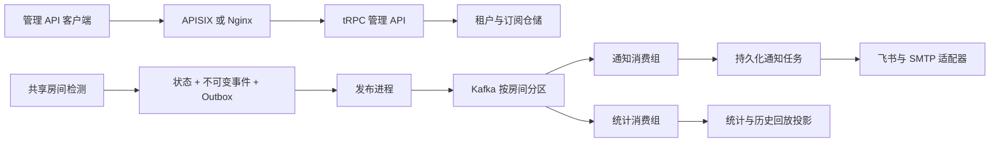

# 架构、依赖与行为

## 可选事件平台

`cmd/monitor` 保留轻量模式；`cmd/event-platform` 是显式启用的平台入口，
不会因为已有 PostgreSQL/Redis 配置自动切换。平台各进程共用一个 Go 模块，
按 `api/detector/relay/router/sender/analytics` 独立部署。

控制模块拥有租户、成员、加密通知对象、订阅和审计；事件模块拥有房间租约、
状态、事件、Outbox；通知模块拥有任务和发送租约；统计模块拥有投影与回放。
API 依赖消费方仓储接口，身份验证与租户授权独立执行。数据库事务保证事件和
状态一起提交；Kafka 发布确认后才标记 published，消费效果持久化后才提交位点。
重复发布、重平衡和发送进程崩溃由事件去重、任务唯一键和租约恢复处理。
外部通知接受后、写入数据库前发生故障仍可能重复，因此不承诺绝对一次送达。

Kafka 不经过网关。网关/API 停机不停止既有检测和发送；Kafka 停机将新事件
积压在 Outbox，恢复后继续路由。回放只重建投影，不能调用发送适配器。
结构化日志、OTel trace context 和持久化任务 trace 字段关联跨进程处理。
监控系统故障不得成为业务事务的提交依赖。

当前是一个仓库中的模块化平台。先用实际容量与故障数据确定拆分需求，
独立进程已经允许分别扩容。若后续拆仓库，需先建立版本化 API/事件契约、
模块独立迁移、独立凭证和数据库权限，再移走模块；不能把共享数据库写入
当作微服务调用。部署与容量边界见 [事件平台部署包](../deploy/event-platform/README.md)，
旧状态导入见 [迁移说明](event-platform/MIGRATION.md)。

## 轻量模式

配置 → 时间窗口 → 轮询或官方事件 → 统一 Observation → Repository（SQLite/PostgreSQL）去重/持久化队列 → 飞书群或应用私聊。

## 检测

轮询调用 B 站房间状态接口，验证业务错误、真实房间 ID、状态和时间。直播状态 1 表示直播，轮播不提醒。优先使用真实房间 ID + 开播时间生成场次键；缺少时间时保留本地场次键，成功观测到下播再开才生成新键。标题更新、重启和恢复网络不会清空有效观察。窗口开始或恢复时正在直播且未通知则补充提醒。

每次请求完成后再等待 1 分钟，因此实际周期包含网络耗时。失败指数退避，最高为正常间隔与 5 分钟的较大值，不把失败当成下播。待发任务先写数据库，通知成功标记 sent；临时失败重试、永久业务错误标记 failed，TTL 默认 30 分钟，窗口外继续处理已经生成的队列。Webhook 无平台幂等键：远端已接收但响应丢失时重试可能重复，不能承诺严格 exactly-once。私聊使用稳定 UUID 辅助平台去重。

官方模式使用平台签名的 start/heartbeat/end 接口，校验返回房间和授权地址，处理 WebSocket 鉴权、心跳、压缩帧与官方开播事件。连接参数仅接受官方授权结果；权限失败阻止运行，清理失败保留会话并先重试清理，禁止再创建重复会话。此模式需要真实资质与房间接入条件。

## 配置切换

修改 `config.yaml` 后重启生效。`detector.mode` 为 polling/official，`notification.mode` 为 feishu_group/feishu_private；只校验所选模式环境变量。私聊需要飞书自建应用机器人、消息权限、发布及接收者可用范围，open_id 必须属于该应用。应用 token 会缓存，失效时刷新。

`deployment.active` 为 local/cloud，由 `switch` 管理，首次准备云端可以 `set-active cloud`。正在运行时禁止直接修改 active。SSH 切换预检目标、停止并禁用源、证明退出、同步配置和数据库、启动目标验证健康。回滚必须先证明目标停止，恢复最新状态；不能确认停止时拒绝启动另一端。不自动双机接管。环境凭证分别配置，不经 SSH 自动复制。

## Go 依赖

- `gopkg.in/yaml.v3`：YAML。
- `modernc.org/sqlite`：无 CGO SQLite，二进制无需外部 SQLite 库。
- `github.com/gorilla/websocket` 与 `github.com/andybalholm/brotli`：官方长连接和压缩帧。
- `trpc.group/trpc-go/trpc-go`：本仓库入口的真实框架服务生命周期、HTTP 服务与管理端口。
- 标准库：HTTP、HMAC、进程管理、时区内嵌、信号、文件权限。

保留 go.mod/go.sum 锁定模块。纯 Go 仍需首次下载并编译较大的 SQLite 模块，构建缓存不是运行依赖。Linux 用 systemd 用户服务和 linger，不要求公网业务端口；Mac 用登录用户 launchd。

默认不连接外部 Redis/PostgreSQL；云端平台可选 pgx、go-redis 与 Redis Streams。检测、通知、数据库、队列和时钟通过接口注入；发送协程独立运行，结果由协调循环提交。独立 observability 包提供 Prometheus 和可选 OTLP，tRPC host 初始化插件、恢复过滤器和进度看门狗。建议云资源从 1 vCPU/1 GB 内存起，实际使用量运行后测量；大规模编译可在 Mac 交叉编译，避免占用小服务器内存。

## 独立仓库边界

本仓库使用独立模块路径 github.com/EthanShen10086/bilibili-live-monitor-trpc-go，不 replace 到相邻目录、不导入另一个实现仓库。共享业务源码在拆分时复制进来，后续分别维护。每次公共行为修复需在两个仓库分别验证，不会自动同步。

生产行为与运维边界以 [上线手册](PRODUCTION_READINESS.md) 为准。
